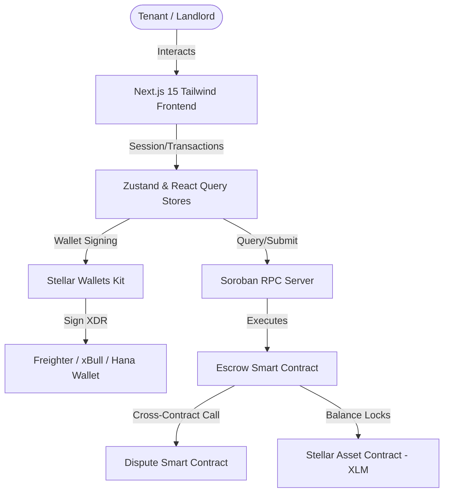

# RentSafe 🔐 
### Decentralized Rental Security Deposit Escrow Platform

<div align="center">

**[Live Demo](https://rent-safe-kappa.vercel.app)** &nbsp;|&nbsp; **[Demo Video]([DEMO_VIDEO_LINK])** &nbsp;|&nbsp; **[Stellar Explorer](https://stellar.expert/explorer/testnet)**


</div>

---

## 📖 Product Overview & Problem Statement

### The Problem
Traditional rental deposits are plagued by friction and distrust:
- **Landlord Misappropriation**: Tenants face delays or unfair deductions at the end of a lease because landlords hold the cash directly.
- **Vague Dispute Claims**: Deductions are often made without verifiable proofs or neutral arbitration.
- **Capital Inefficiency**: Money remains locked up in commercial bank accounts with no transparency on accessibility.

### The Solution
RentSafe introduces **Programmable Escrows** as a neutral third-party:
1. **Escrow Lock**: Deposits are sent and locked in a decentralized smart contract when the lease starts.
2. **State Machine Lifecycle**: Funds can only be released upon mutual agreement (refund/deduction approval) or neutral arbitrator resolution.
3. **Decoupled Dispute Registry**: Disputes are recorded in a separate Dispute Contract that executes back into the Escrow contract via cross-contract callback.

---

## 🏗️ System Architecture

The following Mermaid diagram outlines the layers of RentSafe:



---

## ⚡ Smart Contract Design & Inter-Contract Flow

RentSafe operates using two smart contracts with **Contract-to-Contract (C2C)** communications:
1. **Escrow Contract (`CAX65IYU...`)**: Owns the deposit balances, handles agreement creation, pays/receives SAC tokens, and transitions lease states.
2. **Dispute Contract (`CAPHDBFQ...`)**: Registry of claims escalated for arbitration. Only accessible by the Escrow contract for registrations, and authorized only for the Arbiter/Admin for resolutions.

### Inter-Contract Communication Flow

```mermaid
sequenceDiagram
    autonumber
    actor Tenant
    actor Landlord
    actor Arbiter
    participant Escrow as Escrow Contract
    participant Dispute as Dispute Contract
    participant SAC as Stellar Asset Contract (XLM)

    Landlord->>Escrow: create_agreement(tenant, landlord, amount)
    Tenant->>SAC: approve transfer to Escrow
    Tenant->>Escrow: deposit(agreement_id) (transfers tokens)
    Note over Escrow,SAC: Escrow locks funds, state becomes ACTIVE
    
    rect rgb(20, 20, 35)
        note right of Escrow: Negotiation Clashes
        Landlord->>Escrow: propose_deduction(agreement_id, claim, refund)
        Tenant->>Escrow: raise_dispute(agreement_id, reason)
        Escrow->>Dispute: register_dispute(agreement_id, tenant, landlord, amount, reason)
        Note over Dispute: Dispute status: OPEN, Escrow status: DISPUTED
    end

    rect rgb(20, 35, 20)
        note right of Dispute: Arbitration Resolution
        Arbiter->>Dispute: resolve_dispute(dispute_id, landlord_share, tenant_share)
        Dispute->>Escrow: resolve_dispute_callback(agreement_id, landlord_share, tenant_share)
        Escrow->>SAC: transfer shares to Tenant & Landlord
        Note over Escrow,Dispute: State becomes SETTLED / CLOSED
    end
```


---

## 🛠️ Features & Tech Stack

### Frontend App
- **Landing Page**: Startup-grade presentation, lifecycle features, and TVL tracking.
- **Stellar Wallets Kit**: Supports multi-wallet connections (Freighter, xBull, Hana) with persistent sessions.
- **Tenant & Landlord Dashboards**: Actions to lock deposits, submit proposals, reject claims, or raise disputes.
- **Arbiter Console**: Dedicated interface for admins to resolve active disputes.
- **Real-Time Activity Feed**: Streams smart contract events directly from the RPC ledger.
- **Transaction Center**: Queue showcasing transaction hashes, status (pending/processing/confirmed/failed), explorer links, and a retry mechanism.
- **Responsive & premium UI**: Modern styling using Tailwind CSS, glassmorphism, and confetti animations.

### Blockchain Layer
- **Advanced State Machine**: Custom state transitions: `PendingDeposit` ➔ `Active` ➔ `RefundProposed` ➔ `Disputed` ➔ `Settled`.
- **Custom Persistent Storage**: Limits ledger footprint bloat by storing agreement mappings in persistent storage, complete with TTL rent-bumping.
- **C2C Callback Wiring**: Decoupled registry logic executing callback updates on parent escrows.
- **Admin upgradeability**: Built-in functions to upgrade contract WASM bytecode.

---

## 📸 Screenshots

### Mobile Responsive UI

<div align="center">
  
  &nbsp;
  
  &nbsp;
  
</div>

### Desktop UI & Wallet Connected State


### Create & Fund Escrow Flow


### CI/CD Pipeline Running


### Test Output


---

## 📍 Contract Addresses & Live Transactions

Contracts are built and deployed on the **Stellar Testnet**:

| Contract / Asset | Testnet Address / ID |
|---|---|
| **Escrow Contract** | `CDDJ6HY5DJWMZCNC6BYHGUIG6Z4YKS3FJF56BGU66VXMHCMXQGUJFI36` |
| **Dispute Contract** | `CAMZCYQF4DTCGIU3X637ZHDIUEWZBZGY7LNKJUPDCWUBIFS777KNKAZC` |
| **Native XLM Token (SAC)** | `CDLZFC3SYJYDZT7K67VZ75HPJVIEUVNIXF47ZG2FB2RMQQVU2HHGCYSC` |
| **Deployer Key Address** | `GC23TFTFVKKUB42NYQMTXJLFXQXNMVMAZDUWHO26PCKAHDA6MW3BXQK7` |

### Verified Transactions
- **Escrow Connection to Dispute Contract**:
  - Hash: `1270bb190fa8ee6e938bbbc3266f6453e2bd2c2f8b140a03c0d867a86b159b38`
  - Explorer Link: [StellarExpert Transaction Details](https://stellar.expert/explorer/testnet/tx/1270bb190fa8ee6e938bbbc3266f6453e2bd2c2f8b140a03c0d867a86b159b38)

---

## 💻 Local Development & Testing

### Environment Variables
Configure a `.env.local` inside the `frontend/` directory:
```env
NEXT_PUBLIC_ESCROW_CONTRACT_ID=CDDJ6HY5DJWMZCNC6BYHGUIG6Z4YKS3FJF56BGU66VXMHCMXQGUJFI36
NEXT_PUBLIC_DISPUTE_CONTRACT_ID=CAMZCYQF4DTCGIU3X637ZHDIUEWZBZGY7LNKJUPDCWUBIFS777KNKAZC
NEXT_PUBLIC_TOKEN_SAC=CDLZFC3SYJYDZT7K67VZ75HPJVIEUVNIXF47ZG2FB2RMQQVU2HHGCYSC
NEXT_PUBLIC_SOROBAN_RPC_URL=https://soroban-testnet.stellar.org
NEXT_PUBLIC_NETWORK_PASSPHRASE="Test Stellar Public Network ; September 2015"
```

### Running Smart Contract Tests
Ensure you have Rust and Cargo installed:
```bash
# Run unit tests in the workspace root
cargo test
```

### Running Frontend Tests & Dev Server
Ensure you have Node.js (v18+) installed:
```bash
# Enter frontend folder
cd frontend

# Install packages
npm install

# Run frontend tests (Vitest + React Testing Library)
npm run test

# Run development server
npm run dev
```

---

## 🚀 CI/CD & Deployment Pipeline

The project includes a complete build and deployment workflow:
1. **GitHub Actions (`.github/workflows/ci.yml`)**:
   - Spawns PR checks for smart contract compilation.
   - Installs WASM targets, pins compatible dependencies, and executes `cargo test`.
   - Lints the frontend and runs the Vitest suite.
2. **Automated Deployer (`scripts/deploy.sh`)**:
   - Compiles contracts using `stellar contract build`.
   - Generates and funds deployer key via Friendbot.
   - Deploys and cross-initializes both contracts.
   - Saves addresses directly to `frontend/src/contracts-config.json`.

To run the automated deployment pipeline locally:
```bash
# Execute deployment script from the workspace root
./scripts/deploy.sh
```

---

## 🔒 Security & Best Practices

- **Access Controls & Authorization**: Every state-changing method validates signatures via `Address.require_auth()`.
- **Caller Verification**: The Escrow contract callback (`resolve_dispute_callback`) strictly verifies that the caller is the registered Dispute Contract address. The Dispute Contract registration strictly authorizes only the Escrow Contract.
- **Arithmetic Safety**: Token values are stored as `i128` types, preventing overflow vulnerabilities.
- **Storage Protection**: Uses persistent storage keys with extended TTL margins to prevent unexpected ledger archival.
