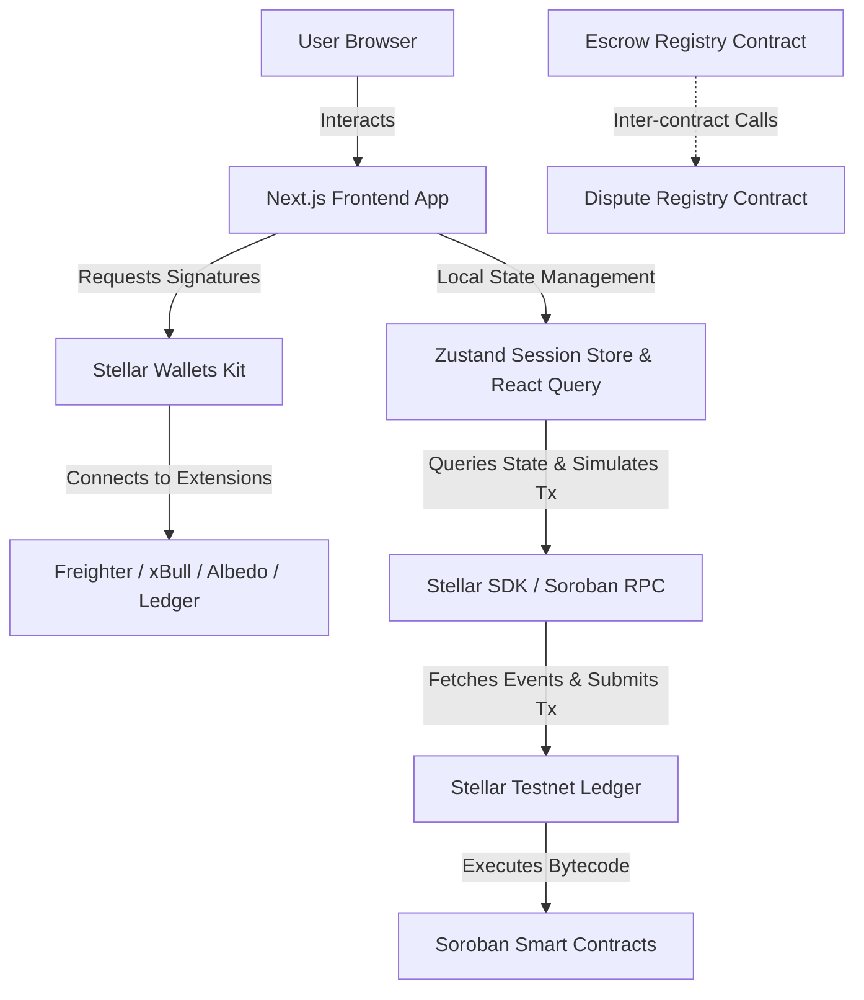

<div align="center">
  
  <h1>RentSafe</h1>
  <p><strong>Production-Grade, Decentralized Rental Deposit Escrow Platform Built on Stellar & Soroban</strong></p>

  [](https://github.com/aniCtrl/RentSafe/actions)
  [](LICENSE)
</div>

---

## 🛠️ Tech Stack
[](https://skillicons.dev)

[](https://stellar.org)
[](https://soroban.stellar.org)
[](https://webassembly.org)

---

## 📖 Product Overview & Problem Statement

### The Problem
Traditional rental deposit schemes are plagued by inefficiency, high transaction costs, lack of transparency, and unilateral hold-ups. Tenants frequently struggle to recover security deposits at lease termination, while landlords face complex administrative burdens, exposure to deposit disputes, and manual payout coordination.

### The Solution
**RentSafe** provides a trustless, decentralized security deposit escrow platform. By locking security deposits into a secure, multi-agreement registry smart contract on the Stellar network, RentSafe guarantees that deposits are custodied transparently. Landlords can request justified deductions, tenants can respond, and in the event of an impasse, platform arbitrators can resolve the dispute on-chain.

---

## 🏗️ System Architecture

The RentSafe frontend is a Next.js single-page application that queries the live ledger state directly from the Soroban RPC network, eliminating the need for private backend databases.


```mermaid
graph TD
    A[User Browser] -->|Interacts| B[Next.js Frontend App]
    B -->|Local State Management| C[Zustand Session Store & React Query]
    B -->|Requests Signatures| D[Stellar Wallets Kit]
    D -->|Connects to Extensions| E[Freighter / xBull / Albedo / Ledger]
    C -->|Queries State & Simulates Tx| F[Stellar SDK / Soroban RPC]
    F -->|Fetches Events & Submits Tx| G[Stellar Testnet Ledger]
    G -->|Executes Bytecode| H[Soroban Smart Contracts]
    H1[Escrow Registry Contract] -.->|Inter-contract Calls| H2[Dispute Registry Contract]
```

---

## 🛡️ Smart Contract Design

RentSafe implements a multi-agreement registry model under unique `u64` IDs.

### 1. Escrow Registry Contract (`rentsafe-escrow`)
* **Responsibilities**:
  * Hosts configuration mapping (Native XLM token address, Dispute contract address, Admin list).
  * Manages agreement registries (property description, deposit/rent amounts, lease range, status).
  * Lock and disburse deposit funds via the Stellar Asset Contract (SAC).
  * Listens to dispute callback resolutions to disburse split awards.
* **Storage Layout**:
  * `EscrowDataKey::Config`: Instance storage storing `EscrowConfig`.
  * `EscrowDataKey::NextAgreementId`: Instance storage keeping the auto-incrementing agreement ID.
  * `EscrowDataKey::Agreement(u64)`: Persistent storage mapping unique IDs to `Agreement` structures.
  * `EscrowDataKey::AgreementIds`: Persistent storage mapping a list of registered IDs.
  * `EscrowDataKey::Role(Address, Symbol)`: Persistent storage mapping account addresses to RBAC symbols.
* **Roles**:
  * `admin`: Authority to perform contract bytecode upgrades (`upgrade`) and modify roles.

### 2. Dispute Registry Contract (`rentsafe-dispute`)
* **Responsibilities**:
  * Registers disputes linked to a specific agreement.
  * Collects chronological evidence logs from dispute participants.
  * Authorizes arbitrators to rule on splits.
  * Executes callbacks to the Escrow contract to trigger payouts.
* **Storage Layout**:
  * `DisputeDataKey::Config`: Instance storage storing linked Escrow address and admin addresses.
  * `DisputeDataKey::Dispute(u64)`: Persistent storage storing dispute records.
  * `DisputeDataKey::DisputeIds`: Persistent storage storing all registered dispute IDs.
  * `DisputeDataKey::Role(Address, Symbol)`: Persistent storage mapping addresses to RBAC symbols.
* **Roles**:
  * `admin`: Authority to configure roles (`add_admin`/`add_arbitrator`) and perform contract upgrades.
  * `arbitrator`: Authority to invoke `resolve_dispute`, deciding final payout splits.

---

## 🔄 Inter-Contract Communication Flow

During a dispute resolution, the Escrow and Dispute contracts coordinate actions to secure the funds and lock states until resolved.


```mermaid
sequenceDiagram
    actor Landlord
    actor Tenant
    participant Escrow as RentSafe Escrow Contract
    participant Dispute as RentSafe Dispute Contract
    actor Arbitrator as Designated Arbitrator (RBAC)

    Landlord->>Escrow: create_agreement(params)
    Note over Escrow: State: Created (0)
    Tenant->>Escrow: lock_deposit(agreement_id)
    Note over Escrow: State: Funded (1)
    Landlord->>Escrow: request_deduction(agreement_id, amount, reason)
    Note over Escrow: State: DeductionRequested (4)
    Tenant->>Escrow: respond_to_deduction(agreement_id, accept=false)
    Note over Escrow: State: DeductionRejected (6)
    Tenant->>Escrow: raise_dispute(agreement_id, reason, evidence)
    Escrow->>Dispute: register_dispute(agreement_id, landlord, tenant)
    Note over Dispute: Deploys Dispute Record
    Note over Escrow: State: AwaitingArbitration (8)
    Arbitrator->>Dispute: resolve_dispute(dispute_id, landlord_amt, tenant_amt)
    Dispute->>Escrow: resolve_dispute_callback(agreement_id, landlord_amt, tenant_amt)
    Note over Escrow: Transfers locked XLM to Landlord & Tenant
    Note over Escrow: State: Settled (9)
    Note over Dispute: State: Resolved (Resolved)
```

---

## ✨ Features

- **Decentralized Escrow**: Deposits are locked in the smart contract, preventing unilateral withholding.
- **Role-Based Access Control (RBAC)**: Storage-backed roles for platform administration (`admin`) and dispute resolution (`arbitrator`).
- **Interactive Multi-Wallet**: Integrated `StellarWalletsKit` supporting Freighter, xBull, and Albedo with active session persistence.
- **Account Switching Listeners**: Real-time listeners update connected user states and balances dynamically when a user changes accounts in their extension.
- **Transaction Center**: Tracking dashboard displaying pending, processing, confirmed, and failed transactions with block explorer redirects and a transaction **Retry** engine.
- **Live Activity Feed**: Event subscription stream polling Soroban RPC for new smart contract event emissions.
- **Human-Readable Errors**: Mapping engine translates raw Soroban VM and RPC exceptions into clear, descriptive alerts.

### System Layer Configuration
| Layer | Technology |
| :--- | :--- |
| **Smart Contracts** | Rust, Soroban SDK |
| **Frontend Framework** | Next.js 16 (App Router), React 19 |
| **State Management** | Zustand (with localStorage persistence), React Query |
| **Wallet Protocol** | `@creit.tech/stellar-wallets-kit` |
| **Blockchain Client** | `@stellar/stellar-sdk` |
| **Styles & Assets** | Vanilla CSS, Google Fonts, Material Icons |

---

## 🚀 Local Development Setup

### 1. Clone & Install
```bash
git clone https://github.com/aniCtrl/RentSafe.git
cd RentSafe
npm install --legacy-peer-deps
```

### 2. Configure Environment Variables
Create a local `.env` file in the root directory:
```bash
cp .env.example .env
```
Populate the contract IDs and addresses. Refer to [DEPLOYMENT.md](file:///Users/bahnishikhasingha/Documents/RentSafe/DEPLOYMENT.md) for details on how to generate these variables.

### 3. Run Frontend Locally
```bash
npm run dev
```
Open [http://localhost:3000](http://localhost:3000) to view the application.

---

## ⚙️ Environment Variables Reference

| Variable Name | Required | Description | Example Value |
| :--- | :--- | :--- | :--- |
| `NEXT_PUBLIC_ESCROW_CONTRACT_ID` | Yes | Address of the deployed Escrow Registry smart contract | `<PASTE_ESCROW_CONTRACT_ID>` |
| `NEXT_PUBLIC_DISPUTE_CONTRACT_ID` | Yes | Address of the deployed Dispute Registry smart contract | `<PASTE_DISPUTE_CONTRACT_ID>` |
| `STELLAR_NETWORK` | Yes | Target Stellar network environment | `testnet` |
| `RENTSAFE_PLATFORM_ADDRESS` | Yes | Public key of the platform admin/arbitrator entity | `GA2C5CQ45P36CQ5...` |
| `RENTSAFE_PLATFORM_SECRET_KEY` | No | Secret key of the platform admin (kept local/gitignored) | `SCLTZBM4PFXT7SU...` |

---

## 🧪 Testing

We maintain high test coverage for both smart contracts and frontend flows.

### Running Smart Contract Tests
Execute the Rust unit test suite:
```bash
cargo test
```

### Running Frontend Tests
Execute the Vitest UI component and flow integration test suites:
```bash
npm run test
```

### Test Results Verification
Below is a verification screenshot showing all contract and frontend tests passing successfully:

```text
// Smart Contract Tests Output:
running 4 tests
test test::test_rbac_grant_revoke_arbitrator ... ok
test test::test_register_dispute_only_callable_by_linked_escrow ... ok
test test::test_rbac_unauthorized_resolve_dispute ... ok
test test::test_resolve_dispute_round_trip_to_escrow_callback ... ok

running 6 tests
test test::test_rbac_unauthorized_upgrade_fails ... ok
test test::test_create_agreement_uninitialized_panics - should panic ... ok
test test::test_create_agreement_bug_reproduce ... ok
test test::test_create_agreement_and_lock_deposit_access_control ... ok
test test::test_request_deduction_accept_and_settle_happy_path ... ok
test test::test_full_round_trip_dispute_resolution ... ok

// Frontend Tests Output:
Test Files  3 passed | 1 skipped (4)
     Tests  9 passed | 1 skipped (10)
  Duration  3.54s
```
`<PASTE_TESTS_PASSING_SCREENSHOT_HERE>`

---

## 🤖 CI/CD Workflows

We configure automated integrations on GitHub Actions:
* **Pull Request Checks** (`pr-checks.yml`): Runs on all PRs targeting `main` or `master`. Executes eslint, typescript compilation checks, smart contract WASM builds, contract unit tests, and React/Vitest suites.
* **Deploy to Vercel** (`deploy.yml`): Automatically builds and deploys the Next.js frontend to production on Vercel upon a merge to `main`.

---

## 🚢 Deployment

Contracts are deployed to the Stellar Testnet using the automated scripts inside `scripts/`.
For a detailed step-by-step walkthrough, see **[DEPLOYMENT.md](file:///Users/bahnishikhasingha/Documents/RentSafe/DEPLOYMENT.md)**.

---

## 🔒 Security Considerations

* **Role-Based Access Control (RBAC)**: Critical operations (such as resolving disputes or upgrading contract bytecode) require explicit authorization. The addresses are validated against storage-backed role values rather than static configurations.
* **Upgrade Authority**: Upgrades of contract code can only be authorized by an address possessing the `admin` role.
* **Known Limitations**:
  * This is a testnet demo application. Real financial assets should not be stored.
  * Local storage is utilized to persist session configurations; users should clear local storage when using public terminals.

---

## 📸 Screenshots

### Mobile Responsive UI (375px Viewport)
`<PASTE_MOBILE_UI_SCREENSHOT_HERE>`

### CI/CD Pipeline Build Running
`<PASTE_CICD_PIPELINE_SCREENSHOT_HERE>`

### Test Verification
`<PASTE_TEST_VERIFICATION_SCREENSHOT_HERE>`

---

## 🔗 Demos & Deployments

* **Live Demo Link**: `<PASTE_LIVE_DEMO_URL_HERE>`
* **Demo Video Walkthrough**: `<PASTE_DEMO_VIDEO_URL_HERE>`

### Active Testnet Smart Contracts:
* **Escrow Contract Address**: `CARQKV7WBR3GRNY3UMAFM4BJJPHAGOI4OPWH2LQLIA2SM55OEPZ5FD7F`
* **Dispute Contract Address**: `CCEXHVWVQTZZEBE7EPDWFTJ3MNWFUP2YX63PCVNTUSATVCRQNT7LSOEZ`
* **Escrow Deploy Tx Hash**: `6ffc390e0db860159f5ddb71d968c3fe9f96c44f6cc38713567562f4ca73b97f`
* **Dispute Deploy Tx Hash**: `04664e169f848bc20e4dfc9e42cad0db73838ef0437cb3d9203fec2d4417f127`

*Explore these transactions and contract states on [Stellar.Expert](https://stellar.expert/explorer/testnet).*

---

## 📄 License

Distributed under the MIT License. See `LICENSE` for more information.
