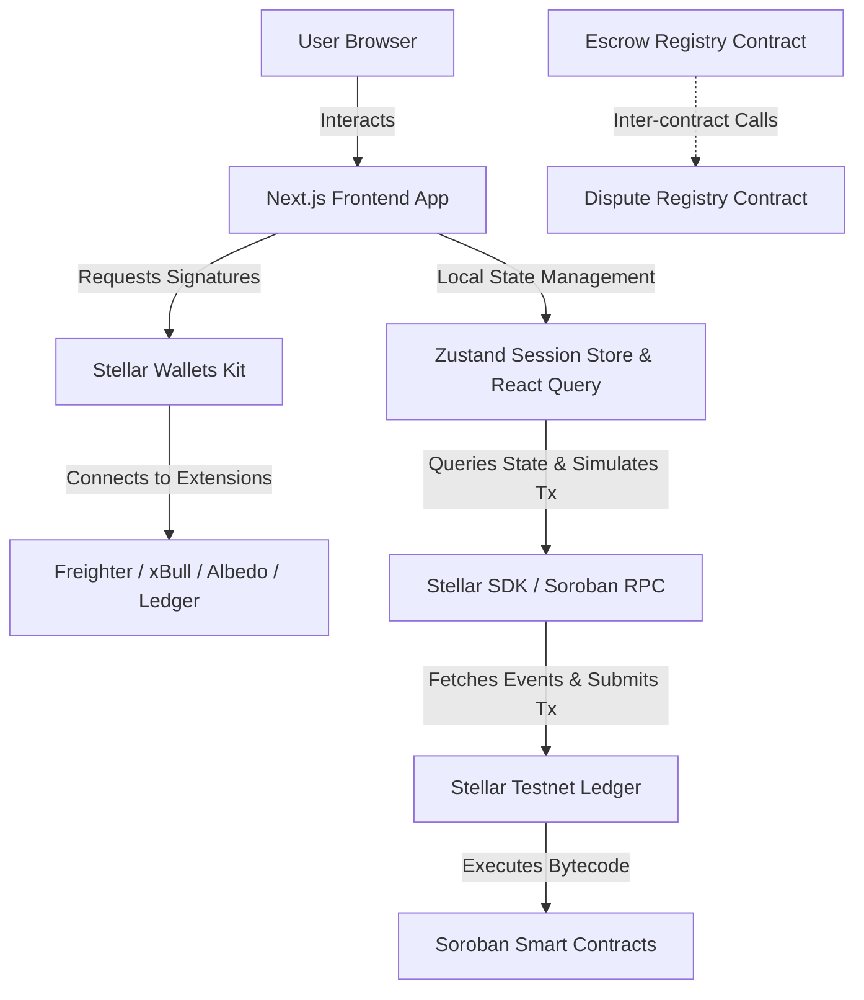
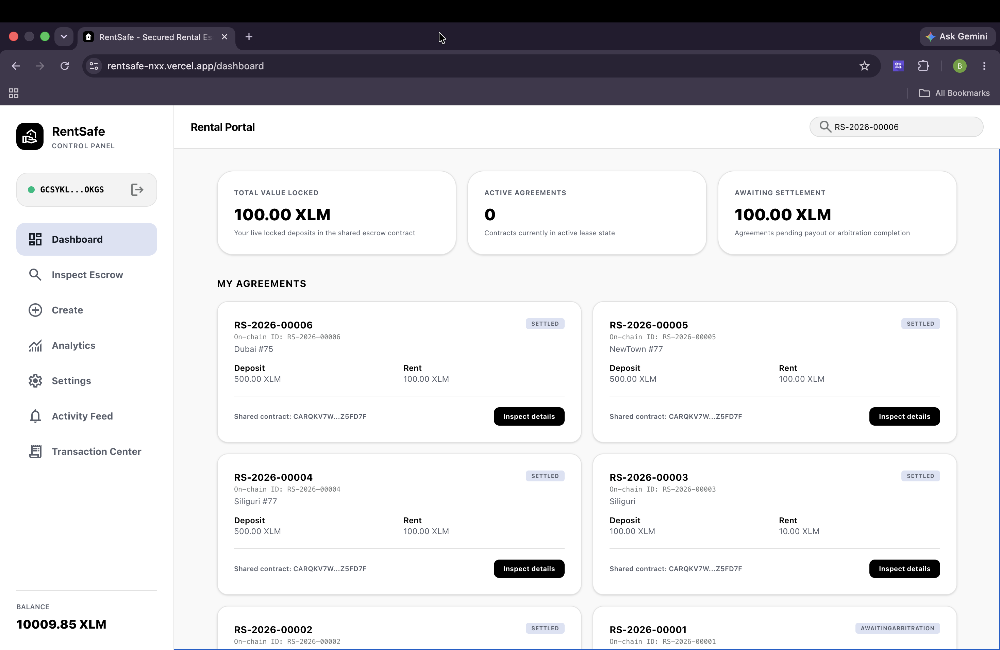
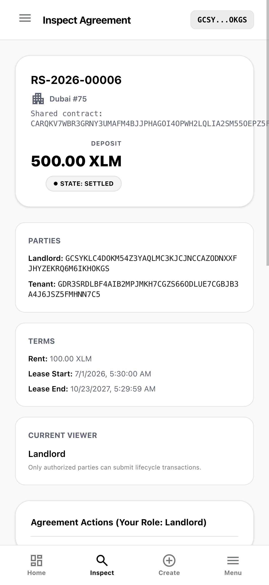
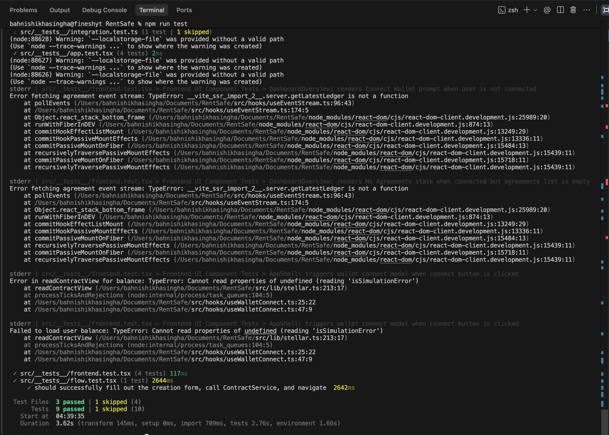
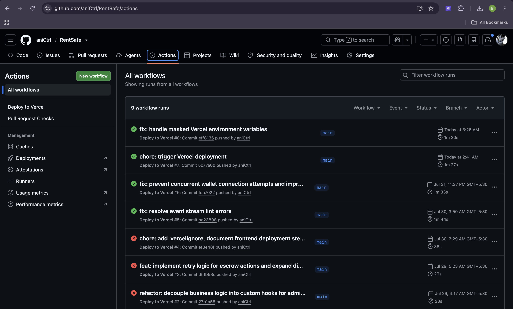

<p align="center">
  
</p>

<p align="center">
  <strong>RentSafe — Production-Grade, Decentralized Rental Deposit Escrow Platform</strong><br/>
  <em>A trustless, decentralized security deposit escrow platform built on Stellar & Soroban, replacing opaque manual agreements with secure on-chain contract coordination.</em>
</p>

<p align="center">
  <a href="https://stellar.expert/explorer/testnet/contract/CARQKV7WBR3GRNY3UMAFM4BJJPHAGOI4OPWH2LQLIA2SM55OEPZ5FD7F"></a>
  <a href="https://stellar.expert/explorer/testnet/contract/CCEXHVWVQTZZEBE7EPDWFTJ3MNWFUP2YX63PCVNTUSATVCRQNT7LSOEZ"></a>
  <a href="LICENSE"></a>
  
  
</p>

---

## Table of Contents

- [1. Product Overview & Problem Statement](#1-product-overview--problem-statement)
- [2. Architecture](#2-architecture)
- [3. Smart Contract Design](#3-smart-contract-design)
  - [3.1 RentSafe Escrow Registry (`rentsafe-escrow`)](#31-rentsafe-escrow-registry-rentsafe-escrow)
  - [3.2 RentSafe Dispute Registry (`rentsafe-dispute`)](#32-rentsafe-dispute-registry-rentsafe-dispute)
- [4. Inter-Contract Communication Flow](#4-inter-contract-communication-flow)
- [5. Features & Tech Stack](#5-features--tech-stack)
- [6. Local Development Setup](#6-local-development-setup)
- [7. CI/CD & Deployment](#7-cicd--deployment)
  - [7.1 Automated CI & Testing (Pull Requests & Pushes)](#71-automated-ci--testing-pull-requests--pushes)
  - [7.2 Automated Deploy (merge to main)](#72-automated-deploy-merge-to-main)
  - [7.3 Contract Deployment (Manual — One-Time or After WASM Change)](#73-contract-deployment-manual--one-time-or-after-wasm-change)
- [8. Security Considerations](#8-security-considerations)
- [9. Screenshots](#9-screenshots)
  - [9.1 Desktop View](#91-desktop-view)
  - [9.2 Mobile Responsive View](#92-mobile-responsive-view)
  - [9.3 Test Verification](#93-test-verification)
  - [9.4 CI/CD Pipeline](#94-cicd-pipeline)
- [10. Contract Addresses & On-Chain Verification](#10-contract-addresses--on-chain-verification)
- [11. Feedback & Responses](#11-feedback--responses)
- [12. Resources & Links](#12-resources--links)
- [Contributing](#contributing)
- [License](#license)

---

## 1. Product Overview & Problem Statement

Traditional rental deposit schemes are plagued by inefficiency, high transaction costs, lack of transparency, and unilateral hold-ups. Tenants frequently struggle to recover security deposits at lease termination, while landlords face complex administrative burdens, exposure to deposit disputes, and manual payout coordination.

**RentSafe** provides a trustless, decentralized security deposit escrow platform built on the Stellar network:

| Pain point | RentSafe solution |
|---|---|
| Unilateral deposit withholding | Deposits are locked securely into the multi-agreement escrow contract, preventing landlord hold-ups. |
| High transaction & admin fees | Leveraging Stellar's high speed and extremely low fees for all agreement transitions. |
| Opaque deposit custody | Funds are custodied transparently on-chain, visible to both parties at all times. |
| Complex, slow refund payouts | Single-click release or refund triggers immediate on-chain settlement. |
| Unresolved deposit disputes | On-chain dispute resolution with evidence submission and arbitrator arbitration. |
| Siloed/opaque dispute rulings | Arbitrator decisions are logged and executed programmatically on-chain. |

---

## 2. Architecture

The RentSafe frontend is a Next.js single-page application that queries the live ledger state directly from the Soroban RPC network, eliminating the need for private backend databases.


```mermaid
graph TD
    A[User Browser] -->|Interacts| B[Next.js Frontend App]
    B -->|Local State Management| C[Zustand Session Store & React Query]
    B -->|Requests Signatures| D[Stellar Wallets Kit]
    D -->|Connects to Extensions| E[Freighter / xBull / Albedo / Ledger]
    C -->|Queries State & Simulates Tx| F[Stellar SDK / Soroban RPC]
    F -->|Fetches Events & Submits Tx| G[Stellar Testnet Ledger]
    G -->|Executes Bytecode| H[Soroban Smart Contracts]
    H1[Escrow Registry Contract] -.->|Inter-contract Calls| H2[Dispute Registry Contract]
```

---

## 3. Smart Contract Design

RentSafe implements a multi-agreement registry model under unique `u64` IDs.

### 3.1 RentSafe Escrow Registry (`rentsafe-escrow`)

**Purpose**: Hosts configuration mapping, manages agreement registries, locks deposit funds, and triggers on-chain disbursements.

**Address**: [`CARQKV7WBR3GRNY3UMAFM4BJJPHAGOI4OPWH2LQLIA2SM55OEPZ5FD7F`](https://stellar.expert/explorer/testnet/contract/CARQKV7WBR3GRNY3UMAFM4BJJPHAGOI4OPWH2LQLIA2SM55OEPZ5FD7F)

#### Storage Model

| Key | Storage tier | Type | Description |
|---|---|---|---|
| `Config` | Instance | `EscrowConfig` | Holds configurations (Native XLM asset contract, Dispute contract, Admin list) |
| `NextAgreementId` | Instance | `u64` | Auto-incrementing agreement ID |
| `Agreement(u64)` | Persistent | `Agreement` | Struct mapping unique ID to agreement state (landlord, tenant, deposit, rent, dates, status) |
| `AgreementIds` | Persistent | `Vec<u64>` | Running list of all registered agreement IDs |
| `Role(Address, Symbol)` | Persistent | `Symbol` | Role authorization map |

#### Public Functions
`initialize` · `create_agreement` · `lock_deposit` · `request_full_refund` · `request_deduction` · `respond_to_deduction` · `raise_dispute` · `settle` · `get_agreement` · `get_agreement_ids` · `upgrade`

---

### 3.2 RentSafe Dispute Registry (`rentsafe-dispute`)

**Purpose**: Manages dispute records linked to agreements, gathers chronological evidence references from participants, and authorizes arbitrators to execute resolution payouts.

**Address**: [`CCEXHVWVQTZZEBE7EPDWFTJ3MNWFUP2YX63PCVNTUSATVCRQNT7LSOEZ`](https://stellar.expert/explorer/testnet/contract/CCEXHVWVQTZZEBE7EPDWFTJ3MNWFUP2YX63PCVNTUSATVCRQNT7LSOEZ)

#### Storage Model

| Key | Storage tier | Type | Description |
|---|---|---|---|
| `Config` | Instance | `DisputeConfig` | Linked Escrow address and super-admin |
| `Dispute(u64)` | Persistent | `Dispute` | Struct storing dispute details, status, splits, and evidence references |
| `DisputeIds` | Persistent | `Vec<u64>` | Running list of all dispute IDs |
| `Role(Address, Symbol)` | Persistent | `Symbol` | Role authorization mapping for platform admin and arbitrators |

#### Public Functions
`initialize` · `register_dispute` · `submit_evidence` · `resolve_dispute` · `get_dispute` · `get_dispute_by_agreement` · `get_dispute_ids` · `upgrade`

---

## 4. Inter-Contract Communication Flow

During a dispute resolution, the Escrow and Dispute contracts coordinate actions to secure the funds and lock states until resolved.


```mermaid
sequenceDiagram
    actor Landlord
    actor Tenant
    participant Escrow as RentSafe Escrow Contract
    participant Dispute as RentSafe Dispute Contract
    actor Arbitrator as Designated Arbitrator (RBAC)

    Landlord->>Escrow: create_agreement(params)
    Note over Escrow: State: Created (0)
    Tenant->>Escrow: lock_deposit(agreement_id)
    Note over Escrow: State: Funded (1)
    Landlord->>Escrow: request_deduction(agreement_id, amount, reason)
    Note over Escrow: State: DeductionRequested (4)
    Tenant->>Escrow: respond_to_deduction(agreement_id, accept=false)
    Note over Escrow: State: DeductionRejected (6)
    Tenant->>Escrow: raise_dispute(agreement_id, reason, evidence)
    Escrow->>Dispute: register_dispute(agreement_id, landlord, tenant)
    Note over Dispute: Deploys Dispute Record
    Note over Escrow: State: AwaitingArbitration (8)
    Arbitrator->>Dispute: resolve_dispute(dispute_id, landlord_amt, tenant_amt)
    Dispute->>Escrow: resolve_dispute_callback(agreement_id, landlord_amt, tenant_amt)
    Note over Escrow: Transfers locked XLM to Landlord & Tenant
    Note over Escrow: State: Settled (9)
    Note over Dispute: State: Resolved (Resolved)
```

---

## 5. Features & Tech Stack

### Tech Stack Table

| Layer | Technology | Description |
|---|---|---|
| **Smart Contracts** | Rust, Soroban SDK | Secure, gas-efficient on-chain contract logic |
| **Frontend Framework** | Next.js 16 (App Router), React 19 | Responsive web application with fast rendering |
| **State Management** | Zustand, React Query | Persistent session states and synchronized server/chain caches |
| **Wallet Protocol** | `@creit.tech/stellar-wallets-kit` | Multi-wallet connector supporting Freighter, xBull, and Albedo |
| **Blockchain Client** | `@stellar/stellar-sdk` | Interface library to execute RPC simulations and build transactions |
| **Styles & Theme** | Vanilla CSS, Outfit Font | Premium aesthetic featuring glassmorphism and custom micro-animations |

---

## 6. Local Development Setup

### 1. Clone & Install
```bash
git clone https://github.com/aniCtrl/RentSafe.git
cd RentSafe
npm install --legacy-peer-deps
```

### 2. Configure Environment Variables
Create a local `.env` file in the root directory:
```bash
cp .env.example .env
```
Populate the contract IDs and addresses. Refer to [DEPLOYMENT.md](file:///Users/bahnishikhasingha/Documents/RentSafe/DEPLOYMENT.md) for details on how to generate these variables.

### 3. Run Frontend Locally
```bash
npm run dev
```
Open [http://localhost:3000](http://localhost:3000) to view the application.

---

## 7. CI/CD & Deployment

### 7.1 Automated CI & Testing (Pull Requests & Pushes)
We configure automated CI/CD workflows on GitHub Actions (`.github/workflows/pr-checks.yml`):
* **Rust Smart Contract Unit Tests**: Executes `cargo test` on all Soroban smart contracts.
* **Frontend Component & Integration Tests**: Executes `npm run test` using Vitest across UI components and user flow routines.
* **Linting & Type Safety**: Runs `npm run lint` and TypeScript compilation checks.

### 7.2 Automated Deploy (merge to main)
* **Deploy to Vercel** (`deploy.yml`): Automatically builds and deploys the Next.js frontend to production on Vercel upon a merge to `main`.

### 7.3 Contract Deployment (Manual — One-Time or After WASM Change)
Contracts are deployed and initialized on the Stellar Testnet in one step using the pure-bash deployment script:
```bash
./scripts/deploy.sh testnet rentsafe-deployer-live rentsafe-admin-live
```
For a detailed step-by-step walkthrough, see **[DEPLOYMENT.md](file:///Users/bahnishikhasingha/Documents/RentSafe/DEPLOYMENT.md)**.

---

## 8. Security Considerations

* **Role-Based Access Control (RBAC)**: Critical operations (such as resolving disputes or upgrading contract bytecode) require explicit authorization. The addresses are validated against storage-backed role values rather than static configurations.
* **Upgrade Authority**: Upgrades of contract code can only be authorized by an address possessing the `admin` role.
* **Known Limitations**:
  * This is a testnet demo application. Real financial assets should not be stored.
  * Local storage is utilized to persist session configurations; users should clear local storage when using public terminals.

---

## 9. Screenshots

| Screen 1 | Screen 2 |
|---|---|
|  |  |
|  |  |

---

## 10. Contract Addresses & On-Chain Verification

### Deployed Contracts (Stellar Testnet)

| Contract | Address | Explorer |
|---|---|---|
| **RentSafe Escrow** | `CCAJ6VCVS7VOKPIIMJ7KI523EAKIDBQ3JNEC3OQ2XNL6FWER2FHGDD25` | [StellarExpert ↗](https://stellar.expert/explorer/testnet/contract/CCAJ6VCVS7VOKPIIMJ7KI523EAKIDBQ3JNEC3OQ2XNL6FWER2FHGDD25) |
| **RentSafe Dispute** | `CDI5FA3JE6SEY7IE34C6LFNIPVFB3D4KA43NASQO55C4YRTIOCVCWQQA` | [StellarExpert ↗](https://stellar.expert/explorer/testnet/contract/CDI5FA3JE6SEY7IE34C6LFNIPVFB3D4KA43NASQO55C4YRTIOCVCWQQA) |
| **Native XLM SAC** | `CDLZFC3SYJYDZT7K67VZ75HPJVIEUVNIXF47ZG2FB2RMQQVU2HHGCYSC` | [StellarExpert ↗](https://stellar.expert/explorer/testnet/contract/CDLZFC3SYJYDZT7K67VZ75HPJVIEUVNIXF47ZG2FB2RMQQVU2HHGCYSC) |

#### RentSafe Escrow

| Action | Transaction Hash | Explorer |
|---|---|---|
| WASM Upload | `6ffc390e0db860159f5ddb71d968c3fe9f96c44f6cc38713567562f4ca73b97f` | [View ↗](https://stellar.expert/explorer/testnet/tx/6ffc390e0db860159f5ddb71d968c3fe9f96c44f6cc38713567562f4ca73b97f) |
| Contract Instantiate | `6ffc390e0db860159f5ddb71d968c3fe9f96c44f6cc38713567562f4ca73b97f` | [View ↗](https://stellar.expert/explorer/testnet/tx/6ffc390e0db860159f5ddb71d968c3fe9f96c44f6cc38713567562f4ca73b97f) |
| `initialize()` | `6ffc390e0db860159f5ddb71d968c3fe9f96c44f6cc38713567562f4ca73b97f` | [View ↗](https://stellar.expert/explorer/testnet/tx/6ffc390e0db860159f5ddb71d968c3fe9f96c44f6cc38713567562f4ca73b97f) |

#### RentSafe Dispute

| Action | Transaction Hash | Explorer |
|---|---|---|
| WASM Upload | `04664e169f848bc20e4dfc9e42cad0db73838ef0437cb3d9203fec2d4417f127` | [View ↗](https://stellar.expert/explorer/testnet/tx/04664e169f848bc20e4dfc9e42cad0db73838ef0437cb3d9203fec2d4417f127) |
| Contract Instantiate | `04664e169f848bc20e4dfc9e42cad0db73838ef0437cb3d9203fec2d4417f127` | [View ↗](https://stellar.expert/explorer/testnet/tx/04664e169f848bc20e4dfc9e42cad0db73838ef0437cb3d9203fec2d4417f127) |
| `initialize()` | `04664e169f848bc20e4dfc9e42cad0db73838ef0437cb3d9203fec2d4417f127` | [View ↗](https://stellar.expert/explorer/testnet/tx/04664e169f848bc20e4dfc9e42cad0db73838ef0437cb3d9203fec2d4417f127) |

### WASM Hashes

| Contract | WASM Hash |
|---|---|
| RentSafe Escrow | `8984492a8ba291fbb4ccced72dba508127e8e10136ef11755f1f79d38c4c216c` |
| RentSafe Dispute | `1e276b85f2fcf604a10937e17e1ef6518c410b869c6e3cb5c29acfa01af5d725` |

---

## 11. Feedback & Responses

We appreciate your feedback and suggestions! Please use the following links to interact with our feedback portal:

* 📝 Submit Feedback (Google Form): [Feedback Form ↗](https://forms.gle/9kgwCvEcJr4hvvYd7)
* 📊 View Responses (Google Sheet): [Feedback Responses Sheet ↗](https://docs.google.com/spreadsheets/d/10yFdYF5G1gfuhXj6hv_vctEDTf28r-psNw4RGJ32YMw/edit?usp=sharing)

---

## 12. Resources & Links

| Resource | Link |
|---|---|
| 🌐 Live demo (Stellar Testnet interface) | [https://rentsafe-nxx.vercel.app ↗](https://rentsafe-nxx.vercel.app/) |
| 🎥 Demo video | [Demo Video ↗](https://youtu.be/1U_yuz7ShHk?si=IPk7D_g2LxCQKtod) |
| 🧪 Testnet faucet | [Stellar Laboratory Friendbot](https://laboratory.stellar.org/#account-creator?network=testnet) |
| 📖 Stellar docs | [developers.stellar.org](https://developers.stellar.org) |
| 🔍 Contract explorer | [StellarExpert Testnet](https://stellar.expert/explorer/testnet) |

---

## Contributing

Fork the repo and create a feature branch.
Follow the Conventional Commits specification for all commit messages.
Run `cargo fmt`, `cargo clippy`, and `npm run lint` before pushing.
Open a PR — the `pr-checks` workflow must pass before review.

---

## License

Distributed under the MIT License. See `LICENSE` for more information.
