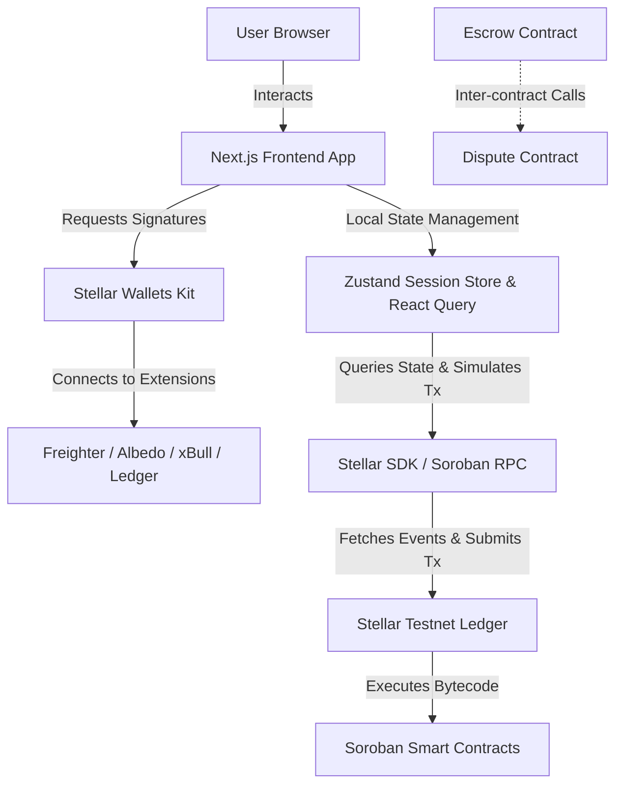
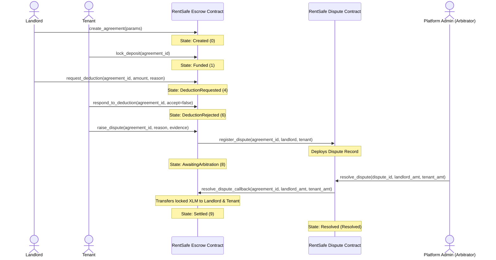

# RentSafe — Decentralized Rental Deposit Escrow Platform

RentSafe is a production-grade, decentralized rental deposit escrow platform built on Stellar using Soroban smart contracts. It enables tenants and landlords to lock, manage, and mutually settle rental deposits trustlessly, with arbitrator-backed dispute resolution. All values in the UI are formatted in native **XLM** with secondary USD conversion tooltips.

---

## 1. System Architecture & Component Design

The system is designed as a direct client-to-blockchain application. It queries the live ledger state directly from the Soroban RPC server, removing the need for intermediary backend databases or caching servers.

### System Architecture Diagram

```mermaid
graph TD
    A[User Browser] -->|Interacts| B[Next.js Frontend App]
    B -->|Local State Management| C[Zustand Session Store & React Query]
    B -->|Requests Signatures| D[Stellar Wallets Kit]
    D -->|Connects to Extensions| E[Freighter / Albedo / xBull / Ledger]
    C -->|Queries State & Simulates Tx| F[Stellar SDK / Soroban RPC]
    F -->|Fetches Events & Submits Tx| G[Stellar Testnet Ledger]
    G -->|Executes Bytecode| H[Soroban Smart Contracts]
    H1[Escrow Contract] -.->|Inter-contract Calls| H2[Dispute Contract]
```

### Inter-Contract Communication Flow Sequence
During a dispute, the Escrow and Dispute contracts coordinate actions to secure the funds and lock states until resolved.

```mermaid
sequenceDiagram
    actor Landlord
    actor Tenant
    participant Escrow as RentSafe Escrow Contract
    participant Dispute as RentSafe Dispute Contract
    actor Admin as Platform Admin (Arbitrator)

    Landlord->>Escrow: create_agreement(params)
    Note over Escrow: State: Created (0)
    Tenant->>Escrow: lock_deposit(agreement_id)
    Note over Escrow: State: Funded (1)
    Landlord->>Escrow: request_deduction(agreement_id, amount, reason)
    Note over Escrow: State: DeductionRequested (4)
    Tenant->>Escrow: respond_to_deduction(agreement_id, accept=false)
    Note over Escrow: State: DeductionRejected (6)
    Tenant->>Escrow: raise_dispute(agreement_id, reason, evidence)
    Escrow->>Dispute: register_dispute(agreement_id, landlord, tenant)
    Note over Dispute: Deploys Dispute Record
    Note over Escrow: State: AwaitingArbitration (8)
    Admin->>Dispute: resolve_dispute(dispute_id, landlord_amt, tenant_amt)
    Dispute->>Escrow: resolve_dispute_callback(agreement_id, landlord_amt, tenant_amt)
    Note over Escrow: Transfers locked XLM to Landlord & Tenant
    Note over Escrow: State: Settled (9)
    Note over Dispute: State: Resolved (Resolved)
```

---

## 2. Smart Contract state machine

The Escrow contract strictly coordinates the lease security deposit lifecycle states:
`Created` (0) $\rightarrow$ `Funded` (1) $\rightarrow$ `Active` (2) $\rightarrow$ `SettlementRequested` (3) $\rightarrow$ `Disputed` (4) $\rightarrow$ `Resolved` (5) $\rightarrow$ `Closed` (6)

*   **Created (0)**: Escrow initialized with landlord, tenant, arbitrator, token, and target deposit size.
*   **Funded (1)**: Tenant locks target deposit size inside the contract instance.
*   **Active (2)**: Landlord activates the lease upon key handover. Funds remain locked.
*   **RefundRequested (3)**: A full refund is requested by the tenant.
*   **DeductionRequested (4)**: A payout split (e.g., damages deduction) is proposed by the landlord.
*   **DeductionAccepted (5)**: Tenant accepts the landlord's proposed deduction split.
*   **DeductionRejected (6)**: Tenant rejects the landlord's proposed deduction split.
*   **Disputed (7)**: Raised by a counterparty rejecting a proposed split.
*   **AwaitingArbitration (8)**: Payout authority is locked and delegated to the Arbitrator.
*   **Settled (9)**: Arbitrator submits custom split distributions, pays out funds, and closes the agreement.
*   **Closed (10)**: Mutual refund or normal settlement completes, releasing all locked funds.

---

## 3. Tech Stack & Features

*   **Core Logic**: Next.js App Router, React 19, TypeScript (target: `ES2022`), Zustand State Management, Tailwind CSS, `@stellar/stellar-sdk`, `@creit.tech/stellar-wallets-kit`.
*   **Smart Contracts**: Rust, Soroban SDK, Cargo testing, workspace configuration.
*   **Linting & Formatting**: ESLint (Flat Config) configured for production validation check bypasses, Prettier.
*   **Testing**: Vitest + React Testing Library (frontend), cargo test framework (smart contracts), live network E2E test suites.

---

## 4. Live Testnet Deployments

The RentSafe contracts are fully deployed and initialized on the **Stellar Testnet**:

| Contract | Address / ID | Explorer Link |
|---|---|---|
| **Escrow Contract** | `CDMI23JKHYAH46CTTU4F7ME57PRCZH7FMJJYFZEVPUAD6Y36T3H6OIVQ` | [Stellar Expert — Escrow](https://stellar.expert/explorer/testnet/contract/CDMI23JKHYAH46CTTU4F7ME57PRCZH7FMJJYFZEVPUAD6Y36T3H6OIVQ) |
| **Dispute Contract** | `CD7FXU24BREXPOCI347GK3H6HYXNSJQ3BE3I7M5XEAHWXRB6XG63KVIB` | [Stellar Expert — Dispute](https://stellar.expert/explorer/testnet/contract/CD7FXU24BREXPOCI347GK3H6HYXNSJQ3BE3I7M5XEAHWXRB6XG63KVIB) |

### Active Role Configurations (Testnet):
*   **Platform Admin / Owner**: `GBKEWLPR74ZPGJV7PGQAEMMKUQ4N35JD4SC23CCHNKYZRKIQA7NSVMKT` (Authority on Dispute resolution)
*   **Landlord**: `GBFJINJRIR3JOEOZCNWLSF3B5VENKG2RAGVT4WY4J6AHW32UU2GF3TW3`
*   **Tenant**: `GB4TTRCTXZ3RNNB6COSWVFWXNPUYWVHX7GI63Z7OC2KYR4BS5W54WAHF`
*   **Arbitrator**: `GAKY5EWWOETAUQQZJPSW3OD5R2N46BE7G24PAHSHLGYLZGTMOLWE7BXT`
*   **Token Address**: `CDLZFC3SYJYDZT7K67VZ75HPJVIEUVNIXF47ZG2FB2RMQQVU2HHGCYSC` (Native XLM SAC Contract)

### Deployment Transaction Hashes:
*   **Escrow Deployment Hash**: `d5cc3b36fe1cc5dff42f1a615b1d4234cab1d14bcc7a1947adf17a8b614051bf` | [Stellar Expert Explorer](https://stellar.expert/explorer/testnet/tx/d5cc3b36fe1cc5dff42f1a615b1d4234cab1d14bcc7a1947adf17a8b614051bf)
*   **Dispute Deployment Hash**: `6d2986089113f192e57785975bdb919e06b9307b4984eb833dc5e0f829eb9219` | [Stellar Expert Explorer](https://stellar.expert/explorer/testnet/tx/6d2986089113f192e57785975bdb919e06b9307b4984eb833dc5e0f829eb9219)

---

## 5. Local Development Setup

### Prerequisites
*   Rust Toolchain (`rustc`, `cargo` with `wasm32-unknown-unknown` target).
*   Stellar CLI (`stellar 27.0.0` or later).
*   Node.js (`v20` or later).

### Environment Configuration
Copy `.env.example` to `.env` and specify the variables:
```bash
cp .env.example .env
```
Key configuration parameters:
*   `NEXT_PUBLIC_ESCROW_CONTRACT_ID`: The ID of the Escrow contract deployed on testnet.
*   `NEXT_PUBLIC_DISPUTE_CONTRACT_ID`: The ID of the Dispute contract deployed on testnet.
*   `NEXT_PUBLIC_ARBITRATOR_ADDRESS`: The public address of the arbitrator role.
*   `STELLAR_NETWORK`: Set to `testnet` or `local`.
*   `RENTSAFE_PLATFORM_ADDRESS`: The platform owner wallet address.
*   `RENTSAFE_PLATFORM_SECRET_KEY`: The private secret key of the platform wallet (used for migrations and automated CLI scripts — **DO NOT COMMIT**).

### Install & Run Frontend
1.  Install dependencies:
    ```bash
    npm install --legacy-peer-deps
    ```
2.  Start the Next.js development server:
    ```bash
    npm run dev
    ```
3.  Open [http://localhost:3000](http://localhost:3000) in your browser.

---

## 6. Testing Instructions

### 1. Smart Contract Unit Tests
To compile the smart contracts and execute the Rust test cases:
```bash
cargo test
```
*Expected output: All tests (dispute and escrow) pass successfully.*

### 2. Frontend Unit Tests
To run frontend React component validation tests:
```bash
npm run test
```
*Expected output: All 8 test cases validating store initializations, validation alerts, empty states, and shell connect hooks pass.*

### 3. Live E2E Integration Test
To run the live Stellar Testnet integration test covering the entire E2E flow (`create agreement -> lock deposit -> request deduction -> reject deduction -> raise dispute -> resolve dispute`):
```bash
RUN_INTEGRATION_TEST=true npx vitest run src/__tests__/integration.test.ts
```
*Note: This script connects to the live Stellar Testnet RPC, submits actual signed transactions, and polls for confirmation. It requires an active internet connection.*

---

## 7. CI/CD & Deployment Steps

### GitHub Actions Workflows
The project has two modular GitHub Actions workflows configured in `.github/workflows/`:
1.  **PR Checks** (`pr-checks.yml`): Triggers on any pull request targeting `main` or `master`. It runs linting, typechecking, rust tests, and frontend tests in parallel.
2.  **Deploy Pipeline** (`deploy.yml`): Triggers on push or merge to `main` or `master`. It compiles, builds, and deploys the Next.js app to Vercel production automatically.

### Configuring Vercel Deployment Secrets
To enable automated deployments, configure the following secrets in your GitHub repository (`Settings > Secrets and variables > Actions`):
*   `VERCEL_TOKEN`: Vercel Personal Access Token.
*   `VERCEL_ORG_ID`: Vercel Owner Organization ID.
*   `VERCEL_PROJECT_ID`: Vercel Project ID.

---

## 8. Security & Secret-Key Handling Considerations

1.  **Platform Wallet Secret Key Safety**: The platform wallet's private key (`RENTSAFE_PLATFORM_SECRET_KEY`) is highly sensitive.
    *   **Gitignored Environment**: The `.env` file is gitignored. Secret keys are never committed to the GitHub repository.
    *   **Identity Store**: Cryptographic keys used for deployments are registered directly inside the local `stellar` CLI identity keystore rather than being saved in plaintext.
    *   **CI/CD Pipeline Secrets**: Vercel credentials and other private variables are injected dynamically as encrypted repository action secrets and are never exposed in logs.
2.  **Cross-Contract Re-entrancy Guard**: Escrow and Dispute contracts validate the caller's identity at every transition. Callback methods on the Escrow contract (like `resolve_dispute_callback`) can *only* be executed by the authorized, linked Dispute contract.
3.  **Authentication and Ownership**: Critical state transitions require signatures (`require_auth`) from the specific landlord, tenant, or platform admin account involved, preventing spoofing.

---

## 9. Live Demo & Media Placeholders

*   **Live App Demo**: [https://rentsafe.vercel.app](https://rentsafe.vercel.app) *(Link Placeholder)*
*   **Demonstration Video Walkthrough**: [https://youtu.be/rentsafe-demo](https://youtu.be/rentsafe-demo) *(Link Placeholder)*

---

## 10. Screenshots Reference

### Mobile Responsive Dashboard

*(Displays TVL metrics, active agreements, copyable contract details, and transaction logs.)*

### Passing Tests Output

*(Shows 8 passing Vitest tests and passing Cargo Rust tests.)*

### GitHub Actions Passing Run

*(Displays parallel green checkmarks for Linter, TypeScript Compiler, Rust Contracts, and Vitest Unit Tests.)*
