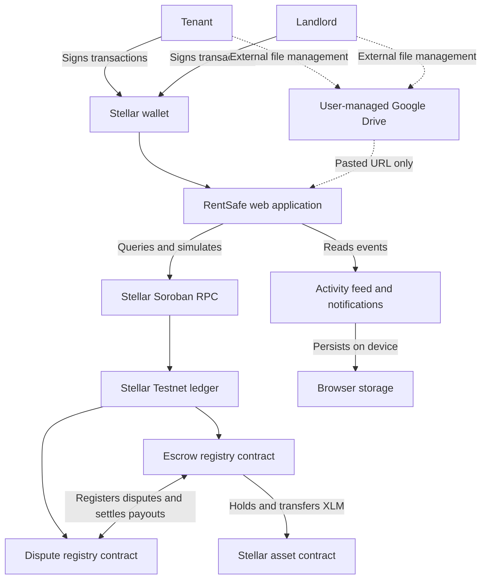

# RentSafe Platform Architecture

RentSafe is a decentralized rental deposit escrow platform for landlords and tenants. The application reads agreement state from Soroban and lets both participants resolve disputed deductions through structured settlement negotiation.

## System Topology

## Component Breakdown

1. **Tenant and landlord wallets**: Sign agreement, deposit, evidence, proposal, and settlement transactions.
2. **RentSafe web application**: Provides the UI, detects the connected participant role, builds transactions, and displays on-chain state.
3. **Soroban RPC and Stellar ledger**: Simulate and submit transactions and expose contract state and events.
4. **Escrow registry contract**: Stores agreements, holds the deposit, manages deductions, and executes the final payout.
5. **Dispute registry contract**: Stores disputes, evidence references, settlement proposals, negotiation history, and the final participant-approved outcome.
6. **Activity and notification state**: Uses live contract events plus device-local persistence. No private application database is required.
7. **External evidence references**: Users may store files in Google Drive or another service. RentSafe stores only the pasted reference.

## Settlement Principle

During negotiation, the deposit remains inside the Escrow contract. Creating, rejecting, or countering a proposal does not move funds. The Dispute contract calls Escrow only after the counterparty accepts a current proposal, and Escrow verifies that the two payouts equal the locked deposit before transferring XLM.
