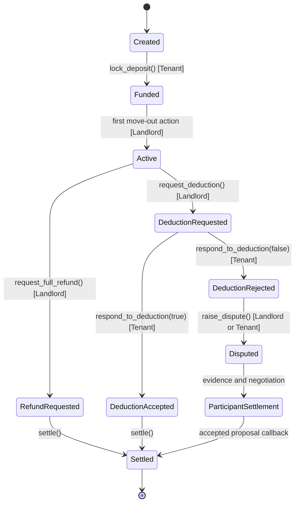
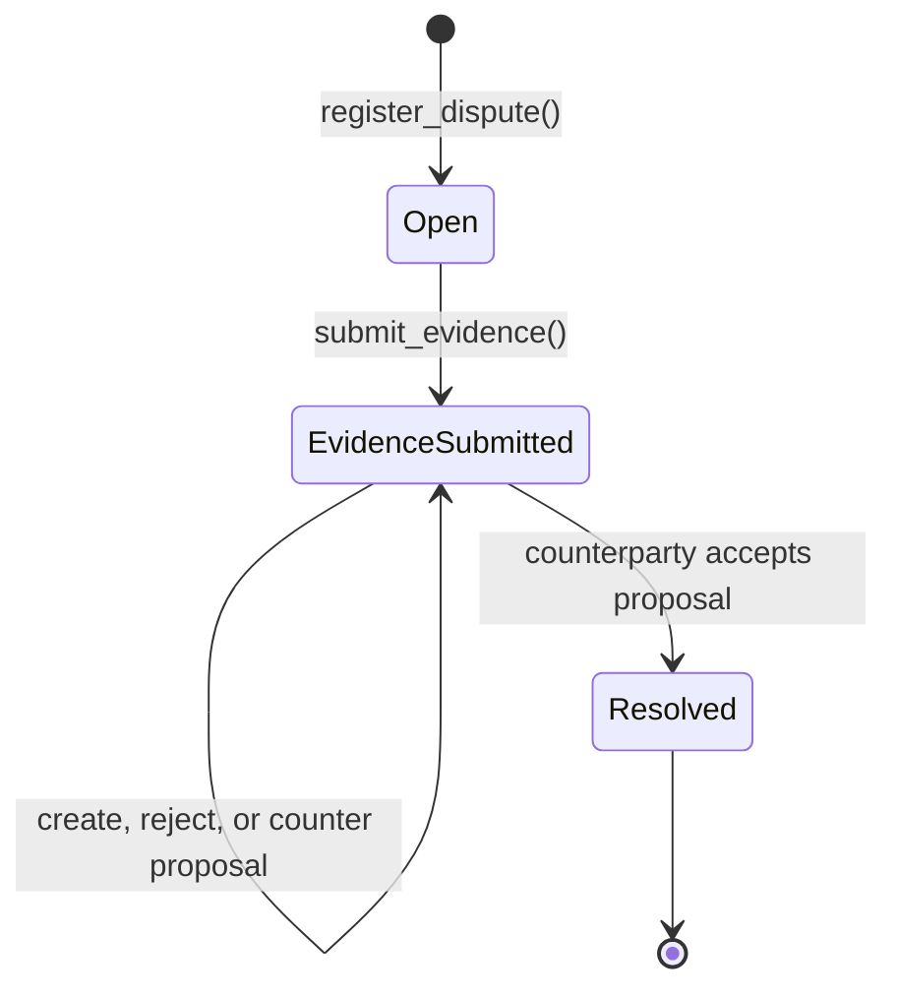

# RentSafe Smart Contract Specification

RentSafe uses two Soroban contracts. The Escrow contract owns the deposit and agreement lifecycle. The Dispute contract owns dispute records, evidence references, and participant settlement proposals.

## 1. Escrow Registry Contract

### Responsibilities

- Create and store agreements under unique `u64` IDs.
- Receive and hold the tenant's deposit.
- Track lease, refund, deduction, dispute, and settled states.
- Call the Dispute contract when a dispute is raised.
- Execute the final payout after the Dispute contract reports an accepted outcome.

### Agreement Lifecycle

### Main Methods

- `create_agreement(...)`: Creates the agreement and records its parties and deposit terms.
- `lock_deposit(agreement_id)`: Transfers the tenant deposit into Escrow.
- `request_full_refund(agreement_id)`: Records a full tenant refund at lease end.
- `request_deduction(agreement_id, amount, reason)`: Records the landlord's requested deduction.
- `respond_to_deduction(agreement_id, accept)`: Lets the tenant accept or reject the deduction.
- `raise_dispute(agreement_id, raised_by, reason, evidence_ref)`: Opens a dispute and links it to the Dispute contract.
- `settle(agreement_id)`: Pays a recorded non-dispute resolution.
- `resolve_dispute_callback(agreement_id, landlord_amount, tenant_amount)`: Accepts the participant-approved split from the linked Dispute contract and distributes the locked deposit.

## 2. Dispute Registry Contract

### Responsibilities

- Store the dispute and its participants.
- Store chronological evidence references.
- Store versioned settlement proposals.
- Keep exactly one current pending proposal available for response.
- Call Escrow only after the other participant accepts the current proposal.

### Dispute Lifecycle

### Proposal States

| State | Meaning |
|---|---|
| `Pending` | The current proposal is waiting for the other participant's response. |
| `Accepted` | The counterparty accepted it and settlement was triggered. |
| `Rejected` | The other participant rejected it. Funds remain locked. |
| `Superseded` | A counter-offer replaced it. It cannot be accepted later. |

### Main Methods

- `register_dispute(...)`: Creates the dispute record from the linked Escrow contract.
- `submit_evidence(dispute_id, submitter, evidence_ref)`: Adds an evidence reference.
- `create_settlement_proposal(dispute_id, landlord_amount, tenant_amount, reason)`: Creates a current participant proposal.
- `accept_settlement_proposal(dispute_id, proposal_id)`: Accepts the current proposal and calls Escrow.
- `reject_settlement_proposal(dispute_id, proposal_id)`: Rejects the current proposal without moving funds.
- `counter_settlement_proposal(dispute_id, proposal_id, landlord_amount, tenant_amount, reason)`: Supersedes the current proposal and creates a new one.

## 3. Settlement Invariants

1. Only the linked landlord or tenant can participate in a dispute's negotiation.
2. A proposal's landlord and tenant amounts must be non-negative.
3. The two final amounts must equal the original locked deposit exactly.
4. Proposal creation, rejection, and counter-offers do not release funds.
5. Only the current pending proposal can be responded to.
6. The accepted proposal is recorded before the Escrow callback executes.

## 4. Events

The contracts publish events for agreement creation, deposit locking, deductions, dispute registration, evidence submission, proposal creation, proposal responses, dispute resolution, and final settlement. The frontend reads these events for the Activity Feed and wallet-scoped notifications.
