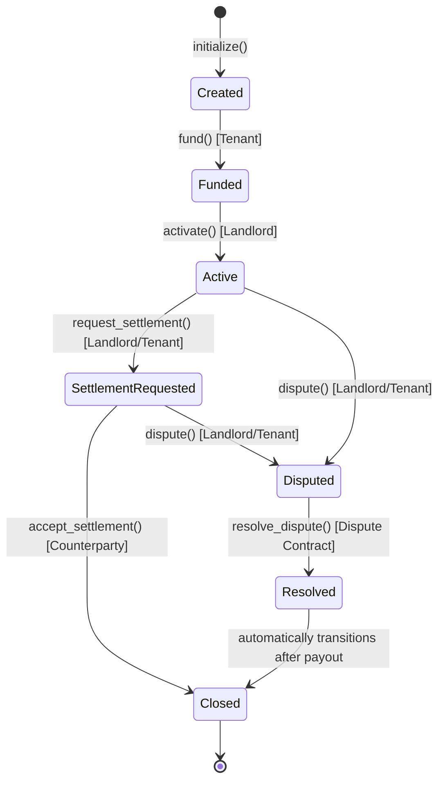
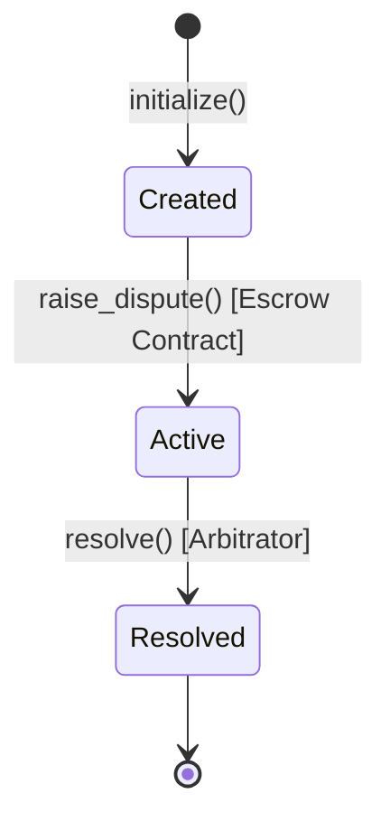

# RentSafe Smart Contract Specification

This document details the storage layout, public interfaces, state machines, and event definitions for both the Escrow and Dispute contracts.

---

## 1. Escrow Smart Contract

The Escrow contract handles agreement configuration, locks tenant deposits, and manages the rental lifecycle.

### State Machine

### Storage Layout

The contract uses Soroban's `instance` storage for configuration and lifecycle parameters since they are queried frequently and updated atomically:

| Key | Storage Type | Data Type | Description |
|---|---|---|---|
| `Landlord` | Instance | `Address` | The landlord's Stellar address |
| `Tenant` | Instance | `Address` | The tenant's Stellar address |
| `Arbitrator` | Instance | `Address` | The designated arbitrator address |
| `Token` | Instance | `Address` | The Stellar Asset Contract address for deposit funds |
| `Amount` | Instance | `i128` | The rental deposit amount to be held |
| `DisputeContract` | Instance | `Address` | The linked Dispute contract address |
| `State` | Instance | `u32` (Enum) | The current Escrow state |
| `ProposedLandlord` | Instance | `i128` | Settlement amount proposed for landlord (if in SettlementRequested) |
| `ProposedTenant` | Instance | `i128` | Settlement amount proposed for tenant (if in SettlementRequested) |
| `ProposedBy` | Instance | `Address` | The party who initiated the settlement proposal |

### Public Methods

- **`initialize(env: Env, landlord: Address, tenant: Address, arbitrator: Address, token: Address, amount: i128)`**
  - Configures contract. Can only be run once. Transitions state to `Created`.
- **`set_dispute_contract(env: Env, dispute_contract: Address)`**
  - Links the Dispute contract. Only callable by the `arbitrator`.
- **`fund(env: Env)`**
  - Requires `tenant` authorization. Transfers `amount` of `token` from tenant to the contract. Transitions state to `Funded`.
- **`activate(env: Env)`**
  - Requires `landlord` authorization. Transitions state to `Active`.
- **`request_settlement(env: Env, landlord_share: i128, tenant_share: i128)`**
  - Requires initiator authorization. Validates that `landlord_share + tenant_share == amount`. Records the proposal. Transitions state to `SettlementRequested`.
- **`accept_settlement(env: Env)`**
  - Requires counterparty authorization. Executes transfer of funds to both landlord and tenant. Transitions state to `Closed`.
- **`dispute(env: Env, caller: Address, evidence_hash: BytesN<32>)`**
  - Requires `caller` auth (landlord or tenant). Transitions state to `Disputed`. Invokes `raise_dispute(caller, evidence_hash)` on the linked Dispute contract.
- **`resolve_dispute(env: Env, landlord_share: i128, tenant_share: i128)`**
  - Requires authorization of `DisputeContract`. Transfers funds according to the split. Transitions state to `Resolved`, then `Closed`.

---

## 2. Dispute Smart Contract

The Dispute contract manages the official dispute case, stores evidence, and enforces the arbitrator's resolution.

### State Machine

### Storage Layout

| Key | Storage Type | Data Type | Description |
|---|---|---|---|
| `EscrowContract` | Instance | `Address` | The linked Escrow contract address |
| `Arbitrator` | Instance | `Address` | The arbitrator's Stellar address |
| `State` | Instance | `u32` (Enum) | The current Dispute state |
| `EvidenceHash` | Persistent | `BytesN<32>` | The SHA-256 hash of dispute evidence/metadata |
| `Disputer` | Instance | `Address` | The party who initiated the dispute |

### Public Methods

- **`initialize(env: Env, escrow_contract: Address, arbitrator: Address)`**
  - Configures contract. Can only be run once. Transitions state to `Created`.
- **`raise_dispute(env: Env, disputer: Address, evidence_hash: BytesN<32>)`**
  - Requires `EscrowContract` authorization. Transitions state to `Active`. Stores the disputer and evidence hash in persistent storage.
- **`resolve(env: Env, landlord_share: i128, tenant_share: i128)`**
  - Requires `Arbitrator` authorization. Validates split matches the escrow amount (done by calling Escrow info or checking total). Calls `resolve_dispute(landlord_share, tenant_share)` on `EscrowContract`. Transitions state to `Resolved`.

---

## 3. Event Schema

Both contracts emit structured events on state transitions.

### Escrow Events

- **Initialize Event**
  - Topics: `(Symbol::new(&env, "escrow"), Symbol::new(&env, "initialized"))`
  - Data: `(landlord: Address, tenant: Address, arbitrator: Address, amount: i128)`
- **Fund Event**
  - Topics: `(Symbol::new(&env, "escrow"), Symbol::new(&env, "funded"))`
  - Data: `(tenant: Address, amount: i128)`
- **Activate Event**
  - Topics: `(Symbol::new(&env, "escrow"), Symbol::new(&env, "activated"))`
  - Data: `(landlord: Address)`
- **Settlement Proposed Event**
  - Topics: `(Symbol::new(&env, "escrow"), Symbol::new(&env, "settlement_proposed"))`
  - Data: `(proposed_by: Address, landlord_share: i128, tenant_share: i128)`
- **Settlement Accepted Event**
  - Topics: `(Symbol::new(&env, "escrow"), Symbol::new(&env, "settlement_accepted"))`
  - Data: `(landlord_share: i128, tenant_share: i128)`
- **Disputed Event**
  - Topics: `(Symbol::new(&env, "escrow"), Symbol::new(&env, "disputed"))`
  - Data: `(caller: Address, evidence_hash: BytesN<32>)`
- **Resolved Event**
  - Topics: `(Symbol::new(&env, "escrow"), Symbol::new(&env, "resolved"))`
  - Data: `(landlord_share: i128, tenant_share: i128)`

### Dispute Events

- **Dispute Raised Event**
  - Topics: `(Symbol::new(&env, "dispute"), Symbol::new(&env, "raised"))`
  - Data: `(escrow: Address, disputer: Address, evidence_hash: BytesN<32>)`
- **Dispute Resolved Event**
  - Topics: `(Symbol::new(&env, "dispute"), Symbol::new(&env, "resolved"))`
  - Data: `(arbitrator: Address, landlord_share: i128, tenant_share: i128)`
