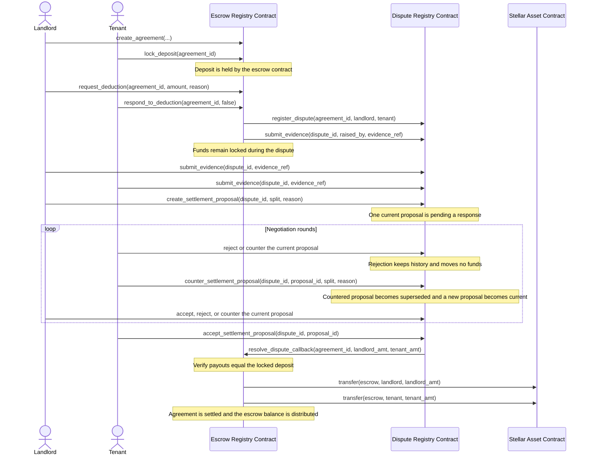

# RentSafe Inter-Contract Flow

This document describes the participant-driven dispute and settlement flow.

## Agreement to Settlement Sequence

## Important Guarantees

1. Only the landlord or tenant can create, respond to, or counter a proposal for their dispute.
2. Proposal creation, rejection, and counter-offers never release escrow funds.
3. A proposal can only be accepted while it is the current pending proposal and by the other participant.
4. The final landlord and tenant payouts must add up exactly to the locked deposit.
5. Only the accepted participant proposal triggers the Dispute-to-Escrow settlement callback.
