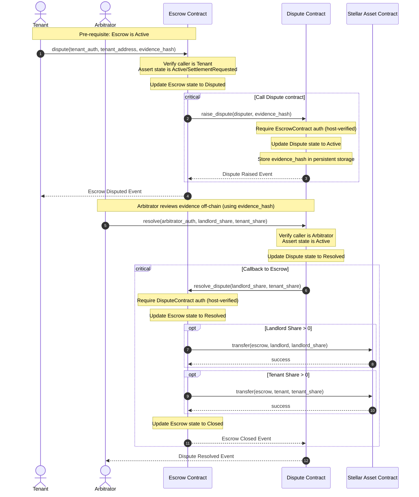

# RentSafe Inter-Contract Flow

This document details the cross-contract interaction during a dispute lifecycle.

## Dispute to Settlement Sequence

The diagram below shows the sequence of transactions and inter-contract invocations when a dispute is raised by the Tenant and resolved by the Arbitrator.

## Security & Verification Mechanics

1. **Authorization Propagation (Step 4)**: 
   When the `Dispute` contract invokes the `Escrow` contract's `resolve_dispute` function:
   - The `Escrow` contract calls `dispute_contract_address.require_auth()`.
   - Because `Dispute` is the caller (the contract currently executing the invoke call), the Soroban host automatically validates this authorization, ensuring no third party can directly invoke `resolve_dispute`.

2. **State Locks (Step 1)**:
   Once the state is changed to `Disputed` in Step 1, all standard settlement actions in the `Escrow` contract (`request_settlement`, `accept_settlement`) are disabled. The funds are effectively locked until the linked `Dispute` contract returns a resolution.
